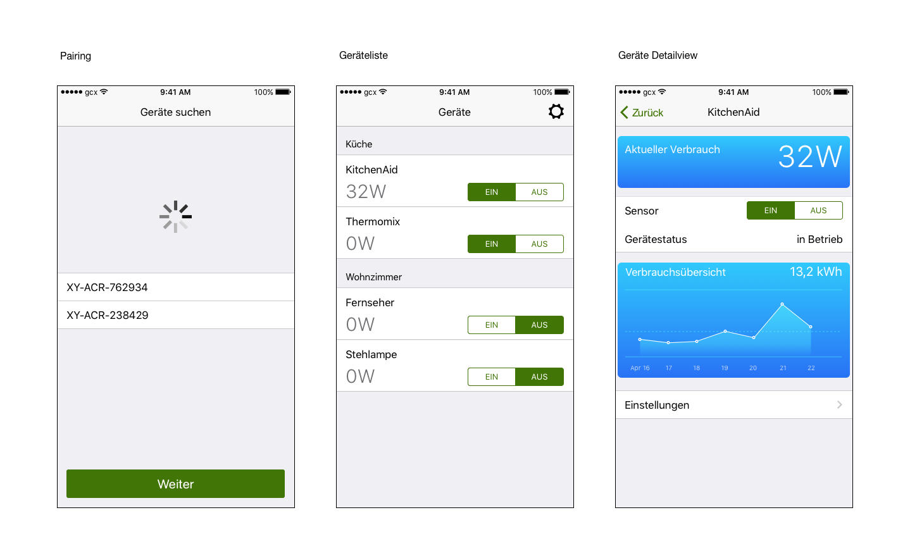

# SmartCentrix Smart Energy

The SmartCentrix Smart Energy App: Development of an app for the communication with energy sensors.

## Background
The SmartCentrix GmbH develops sensors and actuators for the monitoring and control of electrical devices. For the first time the company wants to release a product for the consumer market. Controlling the devices should work via a mobile application. The initial configuration of the sensors will be done directly between the app and the sensor using bluetooth. For further communication the app and the sensors shall talk to a backend service run by the SmartCentrix GmbH. This should allow users to control and monitor their devices from anywhere.

## Rough Concept

The aim of the app is to give the user an intuitive user interface to measure the energy consumption of their devices and to switch them on and off. To achieve this, an initial pairing between app, and the devices is necessary.

## Further Features

* There should be meaningful statistics and visualizations to present the energy consumption to the user.
* When a certain threshold is exceeded the user should be informed via push notification.

## Wireframes

